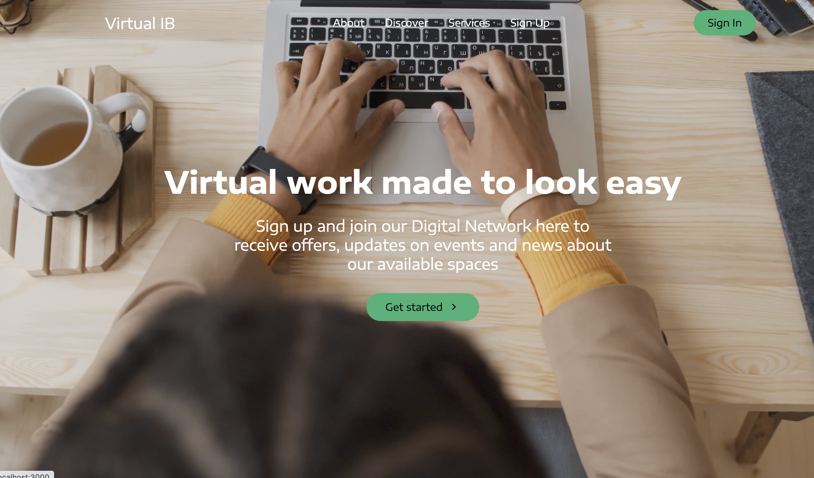

# Virtual Ib
A prototype website for a small business that provides virtual office space to its customers. It is made with React.js, Material UI and hosted on netlify. 

# What I Learned

* Making quality dynamic websites
* Using styled-components. 
* working with svgs. 
* & much more

# App Image
